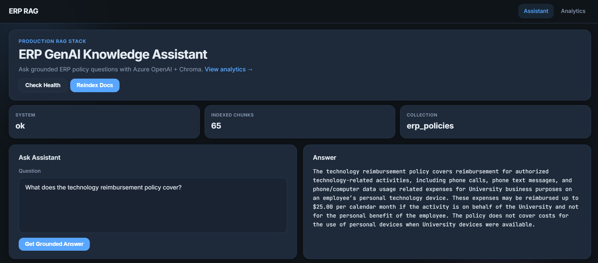
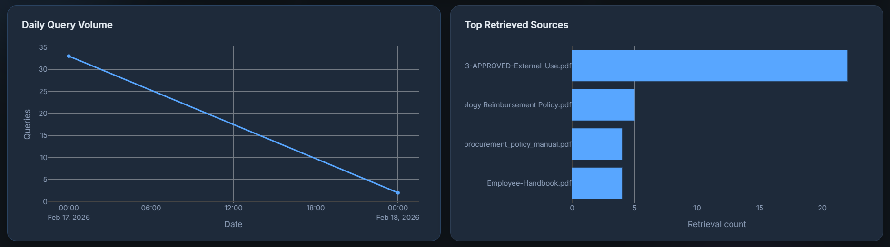
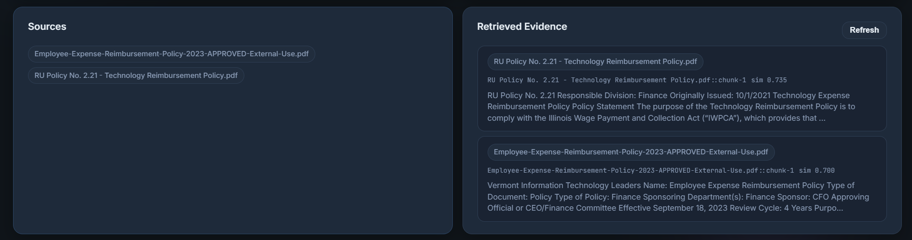
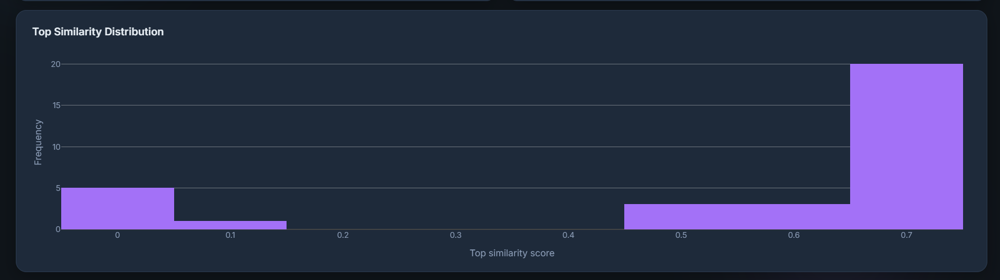
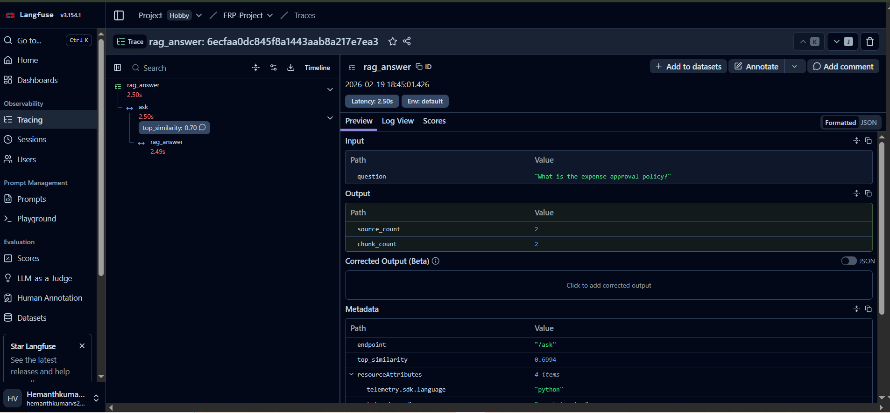
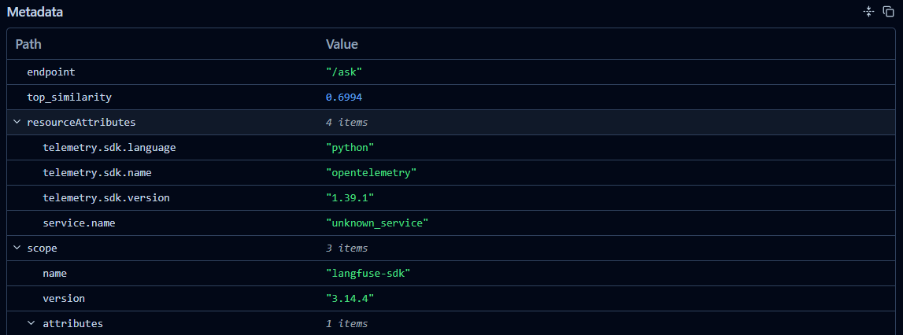
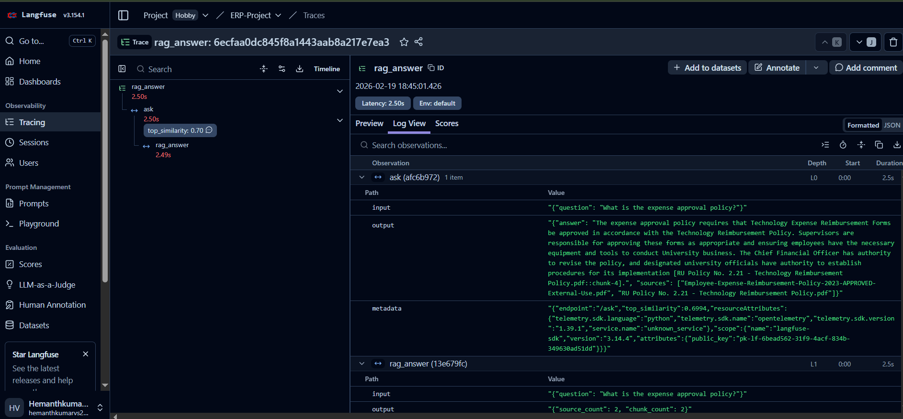
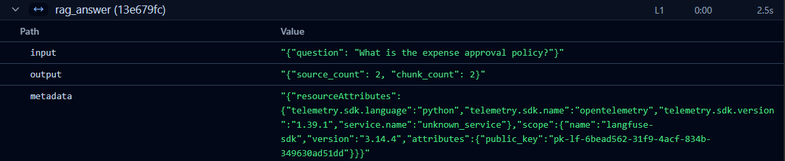
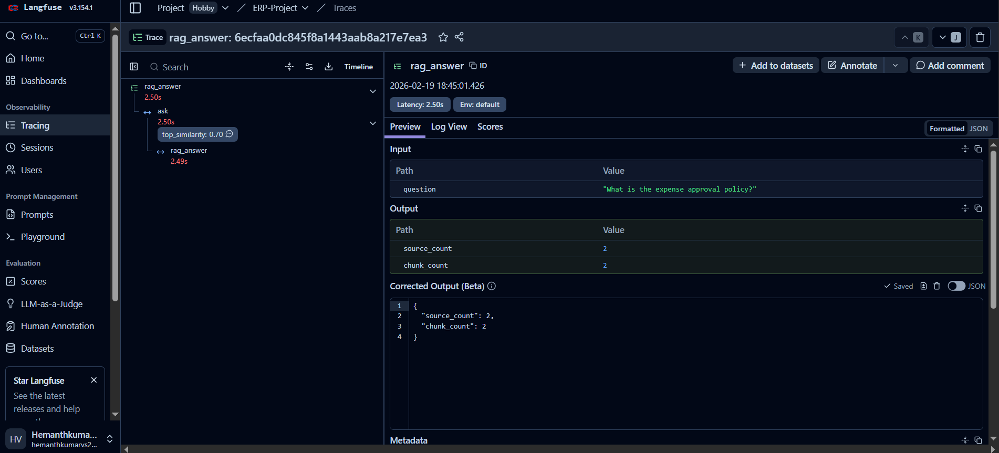

# ERP RAG Assistant

Production-style ERP Knowledge Assistant built with Azure OpenAI, ChromaDB, and FastAPI.

## Features
- PDF policy ingestion from `data/policies`
- Text cleaning and token-aware chunking (500 tokens, 50 overlap)
- Azure OpenAI embeddings (`text-embedding-3-small`)
- Persistent Chroma vector database (`data/chroma_db`)
- Grounded RAG answers using strict prompt constraints
- FastAPI endpoints for Q&A and health checks
- Optional Langfuse observability for ask/reindex tracing
- Conversation memory for follow-up questions via `session_id`

## Project Structure
```text
erp-rag-assistant/
├── main.py
├── rag_pipeline.py
├── embed_index.py
├── config.py
├── requirements.txt
├── .env.example
├── README.md
├── data/
│   ├── policies/
│   └── chroma_db/
└── utils/
    ├── loader.py
    └── chunker.py
```

## Setup
1. Install dependencies:
   ```bash
   pip install -r requirements.txt
   ```
2. Copy environment template:
   ```bash
   cp .env.example .env
   ```
3. Fill `.env` with Azure OpenAI credentials.
4. Add ERP policy PDFs into `data/policies`.
5. (Optional) Fill Langfuse env vars to enable tracing.

### Optional Langfuse Setup
Add these values in `.env`:
```env
LANGFUSE_PUBLIC_KEY=pk-lf-...
LANGFUSE_SECRET_KEY=sk-lf-...
LANGFUSE_HOST=https://cloud.langfuse.com
```

If keys are not set, the app runs normally with Langfuse disabled.

## Langfuse Observability
This project sends traces to Langfuse for:
- `POST /ask` (trace + `rag_answer` span)
- `POST /ask/stream` (trace + retrieval metadata)
- `POST /reindex` (trace + index build span)

Quick verification from terminal (PowerShell):
```powershell
$body = @{ question = "What is the expense approval policy?" } | ConvertTo-Json
Invoke-RestMethod -Method Post -Uri "http://localhost:8000/ask" -ContentType "application/json" -Body $body
```

Then open Langfuse -> `Tracing` and confirm new traces appear.

## Build Vector Index
```bash
python embed_index.py
```

## Run API
```bash
uvicorn main:app --reload
```

Open docs: `http://localhost:8000/docs`
Open web UI: `http://localhost:8000/ui`
Open analytics UI: `http://localhost:8000/ui/analytics`

## API Endpoints
- `GET /` -> welcome message
- `GET /health` -> service and vector DB status
- `GET /chunks?limit=20` -> chunk preview from Chroma
- `GET /analytics/data` -> query usage + source + similarity analytics payload
- `POST /reindex` -> rebuild index from PDFs and reload pipeline
- `DELETE /memory/{session_id}` -> clear stored conversation turns for a session
- `POST /ask`
  - Request:
    ```json
    {
      "question": "Why was my expense rejected?",
      "session_id": "employee-123"
    }
    ```
  - Response:
    ```json
    {
      "question": "Why was my expense rejected?",
      "answer": "...",
      "sources": ["expense_policy.pdf"],
      "session_id": "employee-123"
    }
    ```

## Notes
- Answers are grounded and instructed to return `"I don't know"` if context is missing.
- Run `python embed_index.py` whenever policy PDFs change.
- Reuse the same `session_id` across calls to enable short follow-up memory.
- Langfuse traces are emitted for:
  - `POST /ask`
  - `POST /ask/stream`
  - `POST /reindex`
- The custom web UI at `/ui` supports:
  - health check
  - reindex trigger
  - grounded ask flow
  - source chips and retrieved evidence preview
- Analytics dashboard at `/ui/analytics` uses Plotly charts for:
  - daily query volume
  - top retrieved policy files
  - similarity score distribution

## Screenshots

### Assistant UI


### Analytics Overview


### Sources and Retrieved Evidence


### Similarity Distribution


### Langfuse Trace View


### Langfuse Metadata


### Langfuse Log View


### Langfuse Rag Answer


### Langfuse Preview

